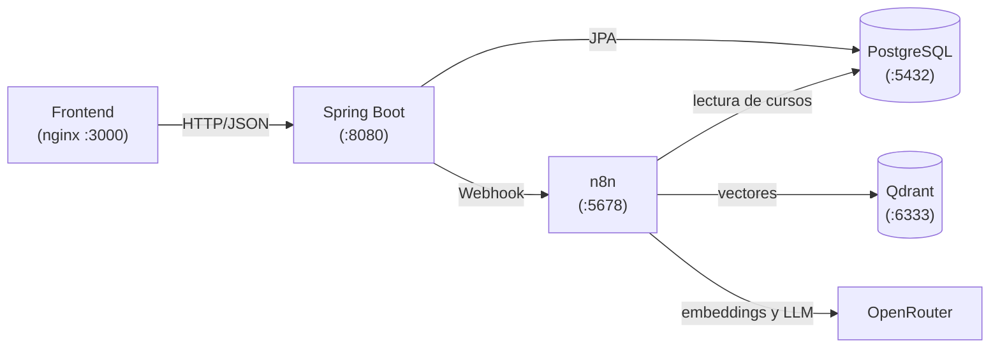

# RutaIA

Plataforma web que recomienda cursos a partir de una necesidad escrita en lenguaje natural, usando
búsqueda semántica y generación aumentada por recuperación (RAG).

## Integrantes

- Juan Felix Ballesteros Diaz

---

## Problemática

Una búsqueda tradicional basada en palabras falla cuando la forma de preguntar no coincide con el
nombre o la descripción de un curso. Un estudiante que escribe *"quiero aprender a crear páginas web"*
no encuentra un curso llamado *"Desarrollo Frontend"*, aunque sea exactamente lo que necesita.

## Solución

RutaIA entiende la **intención** del estudiante:

1. Convierte la pregunta en un **embedding** (un vector que representa su significado).
2. Busca en **Qdrant** los cursos activos cuyo significado es más parecido.
3. Descarta los cursos que no superan un **umbral de relevancia** calibrado con pruebas reales.
4. Envía solo los cursos relevantes a un **modelo de lenguaje**, que genera una recomendación
   personalizada según el nivel del estudiante, **usando únicamente esos cursos como fuente**.
5. Si ningún curso es relevante, responde *Sin resultados* sin llamar al modelo, por lo que nunca
   inventa cursos que no existen.

Cada consulta queda registrada con su estado, la recomendación, las fuentes y la similitud de cada una.
El estudiante puede revisar su historial y calificar las recomendaciones.

---

## Tecnologías

| Capa | Tecnología |
|---|---|
| Frontend | HTML, CSS y JavaScript (Fetch API, async/await, módulos ES), servido con nginx |
| Backend | Java 21, Spring Boot 4.1.1, Spring Web, Spring Data JPA, Jakarta Validation, Gradle, springdoc (Swagger) |
| Base relacional | PostgreSQL 16 |
| Base vectorial | Qdrant |
| Automatización | n8n |
| IA | OpenRouter: `openai/text-embedding-3-small` (embeddings) y `openai/gpt-4o-mini` (recomendaciones) |
| Contenedores | Docker y Docker Compose |

## Arquitectura



- El frontend **solo** se comunica con Spring Boot.
- Spring Boot guarda la consulta como **PENDIENTE** antes de llamar a n8n, y valida que las fuentes
  devueltas existan y estén activas en PostgreSQL antes de guardarlas.
- n8n ejecuta dos flujos: la **indexación** de cursos en Qdrant y la **consulta RAG**.

La arquitectura completa, el diagrama de secuencia y las decisiones técnicas están en
[`docs/arquitectura.md`](docs/arquitectura.md).

---

## Estructura del repositorio

```
rutaia/
├── backend/              API REST con Spring Boot
├── frontend/             Interfaz web (HTML, CSS, JS)
├── database/
│   ├── schema.sql        Script de creación de tablas, restricciones e índices
│   ├── seed_cursos.sql   Catálogo inicial de 27 cursos
│   └── diagrama_er.md    Diagrama entidad-relación
├── n8n/workflows/
│   ├── 01_indexacion_cursos.json
│   └── 02_consulta_rag.json
├── docs/
│   ├── arquitectura.md
│   ├── calibracion_umbral.md
│   ├── documento_pruebas.md
│   ├── RutaIA.postman_collection.json
│   └── evidencias/
├── docker-compose.yml
└── .env.example
```

---

## Requisitos de instalación

- **Docker Desktop** (en Windows, con WSL 2 y la virtualización habilitada).
- **Java 21** (JDK).
- **Git**.
- Una **API key de OpenRouter** con saldo disponible. El costo de las pruebas es de una fracción de
  centavo de dólar.
- Opcional: **Postman**, para ejecutar la colección de pruebas.

## Variables de entorno

Copia la plantilla y completa los valores:

```
copy .env.example .env        (Windows)
cp .env.example .env          (Linux / macOS)
```

| Variable | Uso |
|---|---|
| `POSTGRES_DB` | Nombre de la base de datos |
| `POSTGRES_USER` | Usuario de PostgreSQL |
| `POSTGRES_PASSWORD` | Contraseña de PostgreSQL |
| `N8N_ENCRYPTION_KEY` | Clave con la que n8n cifra las credenciales guardadas |
| `OPENROUTER_API_KEY` | API key de OpenRouter (se registra como credencial en n8n) |
| `N8N_WEBHOOK_URL` | URL del webhook del flujo RAG (opcional; tiene valor por defecto) |

Escribe los valores **sin comillas** y evita los caracteres `$`, `#` y los espacios.

> **Importante:** la contraseña de PostgreSQL solo se aplica la primera vez que se crea el
> contenedor. Si la cambias después, actualízala dentro de la base con
> `ALTER USER rutaia WITH PASSWORD '...'` o recrea el volumen.

El archivo `.env` está excluido del repositorio en `.gitignore`. Spring Boot lo lee con
`spring.config.import`, así que ninguna clave aparece en el código.

---

## Ejecución

### 1. Contenedores

```
docker compose up -d
docker compose ps
```

Se levantan cuatro servicios:

| Servicio | URL |
|---|---|
| Frontend | http://localhost:3000 |
| n8n | http://localhost:5678 |
| Qdrant | http://localhost:6333/dashboard |
| PostgreSQL | localhost:5432 |

### 2. Base de datos

```
docker cp database/schema.sql rutaia-postgres:/tmp/schema.sql
docker exec -it rutaia-postgres psql -U rutaia -d rutaia -f /tmp/schema.sql

docker cp database/seed_cursos.sql rutaia-postgres:/tmp/seed_cursos.sql
docker exec -it rutaia-postgres psql -U rutaia -d rutaia -f /tmp/seed_cursos.sql
```

> Ambos scripts **borran los datos existentes** al ejecutarse. Úsalos solo en la instalación inicial.

### 3. Workflows de n8n

1. Abre http://localhost:5678 y crea la cuenta de propietario local.
2. Crea dos credenciales en **Credentials**:
   - **Postgres:** host `postgres` (nombre del servicio en Docker, no `localhost`), base `rutaia`,
     usuario y contraseña del `.env`, puerto `5432`.
   - **Header Auth** (llámala *OpenRouter*): nombre `Authorization`, valor `Bearer <tu API key>`.
3. Importa los dos archivos de `n8n/workflows/` con **Import from File**.
4. Asigna las credenciales:
   - *Indexación:* Postgres en **Leer cursos** y OpenRouter en **Generar embedding**.
   - *Consulta RAG:* OpenRouter en **Embedding de la pregunta** y **Generar recomendación**.
5. Ejecuta el flujo **RutaIA - Indexación de cursos en Qdrant**. En el dashboard de Qdrant, la
   colección `cursos` debe tener 27 puntos.
6. **Activa** el flujo **RutaIA - Consulta RAG** para habilitar su URL de producción.

### 4. Backend

Desde IntelliJ IDEA, ejecuta `BackendApplication`, o por terminal:

```
cd backend
gradlew bootRun          (Windows)
./gradlew bootRun        (Linux / macOS)
```

La API queda en http://localhost:8080 y la documentación Swagger en
http://localhost:8080/swagger-ui.html.

### 5. Frontend

Ya está disponible en http://localhost:3000, servido por el contenedor de nginx. No requiere
instalación ni compilación.

---

## Endpoints principales

| Método | Ruta | Descripción |
|---|---|---|
| POST | `/api/estudiantes` | Registrar un estudiante |
| GET | `/api/estudiantes` | Listar estudiantes |
| GET | `/api/estudiantes/{id}` | Consultar un estudiante |
| GET | `/api/estudiantes/{id}/historial` | Historial de consultas del estudiante |
| GET | `/api/cursos?categoria=&nivel=` | Catálogo de cursos activos con filtros |
| GET | `/api/cursos/categorias` | Categorías disponibles |
| GET | `/api/cursos/{id}` | Detalle de un curso activo |
| POST | `/api/admin/cursos` | Registrar un curso |
| GET | `/api/admin/cursos` | Listar todos los cursos, incluidos los inactivos |
| GET | `/api/admin/cursos/{id}` | Consultar un curso |
| PUT | `/api/admin/cursos/{id}` | Actualizar un curso |
| PATCH | `/api/admin/cursos/{id}/desactivar` | Desactivar un curso |
| PATCH | `/api/admin/cursos/{id}/activar` | Reactivar un curso |
| POST | `/api/consultas` | Realizar una consulta y obtener la recomendación |
| GET | `/api/consultas/{id}` | Detalle de una consulta |
| POST | `/api/recomendaciones/{id}/calificacion` | Calificar una recomendación |
| GET | `/api/estadisticas` | Estadísticas del sistema |

### Ejemplo: registrar un estudiante

```
POST /api/estudiantes
```

```json
{
  "nombreCompleto": "Ana Gómez",
  "correo": "ana@correo.com",
  "nivelExperiencia": "Principiante",
  "areaInteres": "Desarrollo web"
}
```

Respuesta `201 Created` con el estudiante y su `id`.

### Ejemplo: realizar una consulta

```
POST /api/consultas
```

```json
{
  "estudianteId": 1,
  "pregunta": "Necesito desplegar aplicaciones usando contenedores"
}
```

Respuesta `201 Created` (resumida):

```json
{
  "id": 12,
  "pregunta": "Necesito desplegar aplicaciones usando contenedores",
  "estado": "RESPONDIDA",
  "recomendacion": {
    "id": 9,
    "respuesta": "Te recomiendo empezar con Contenedores con Docker...",
    "fuentes": [
      { "posicion": 1, "cursoId": 25, "nombre": "Contenedores con Docker", "similitud": 0.6699, "mencionado": true },
      { "posicion": 2, "cursoId": 26, "nombre": "Kubernetes y Despliegue en la Nube", "similitud": 0.5656, "mencionado": true }
    ],
    "calificacion": null
  }
}
```

Estados posibles de una consulta:

| Estado | Significado |
|---|---|
| `PENDIENTE` | Registrada, esperando la respuesta de n8n |
| `RESPONDIDA` | Se generó una recomendación con cursos |
| `SIN_RESULTADOS` | Ningún curso superó el umbral de relevancia |
| `ERROR` | Falló n8n, Qdrant u OpenRouter, o la respuesta no fue válida |

### Formato de errores

Todos los errores de la API tienen el mismo formato:

```json
{
  "fecha": "2026-09-23T10:15:00",
  "estado": 400,
  "error": "Bad Request",
  "mensaje": "La petición tiene datos inválidos",
  "ruta": "/api/estudiantes",
  "errores": { "correo": "El correo no tiene un formato válido" }
}
```

---

## Pruebas

- **Colección de Postman:** importa `docs/RutaIA.postman_collection.json` y ejecútala completa con
  el *Collection Runner*. Contiene 37 peticiones con pruebas automáticas, incluidas las 10 consultas
  obligatorias.
- **Documento de pruebas:** [`docs/documento_pruebas.md`](docs/documento_pruebas.md).
- **Calibración del umbral de relevancia:** [`docs/calibracion_umbral.md`](docs/calibracion_umbral.md).

## Funcionalidades adicionales implementadas

- **Panel administrativo** de cursos en el frontend.
- **Dashboard de estadísticas** en el frontend.
- **Filtro vectorial** en Qdrant: la búsqueda solo considera puntos con `activo = true`.
- **Pruebas automatizadas** de la API con la colección de Postman.

---

## Errores conocidos

- **Coincidencia de términos en la búsqueda semántica.** Cursos que comparten palabras con la pregunta
  pueden superar el umbral sin ser relevantes. Por ejemplo, en *"quiero aprender a proteger
  aplicaciones web"*, dos cursos de desarrollo web obtuvieron cerca de 0.48 por el término
  "aplicaciones web". Se mitiga con una regla del prompt que pide recomendar solo los cursos que
  respondan a la necesidad, y el frontend muestra esos cursos aparte gracias al campo `mencionado`.
- **La sincronización con Qdrant es manual.** Después de crear, editar, desactivar o activar cursos, se
  debe ejecutar de nuevo el flujo de indexación. Si no se hace, las consultas que recuperen un curso
  desactualizado terminan en ERROR. Es un comportamiento seguro, pero requiere reindexar.
- **Algunas consultas devuelven menos de tres fuentes.** Cuando solo dos cursos superan el umbral, se
  prioriza la relevancia sobre la cantidad mínima de cursos.
- **Sin autenticación.** El estudiante activo se elige en el navegador y las rutas administrativas no
  están protegidas. No es un requisito obligatorio del proyecto.
- **Proyecto dentro de OneDrive.** Si la carpeta del proyecto está sincronizada con OneDrive, pueden
  aparecer errores de "archivo en uso" al compilar. La solución es mover el proyecto a una carpeta sin
  sincronización.
