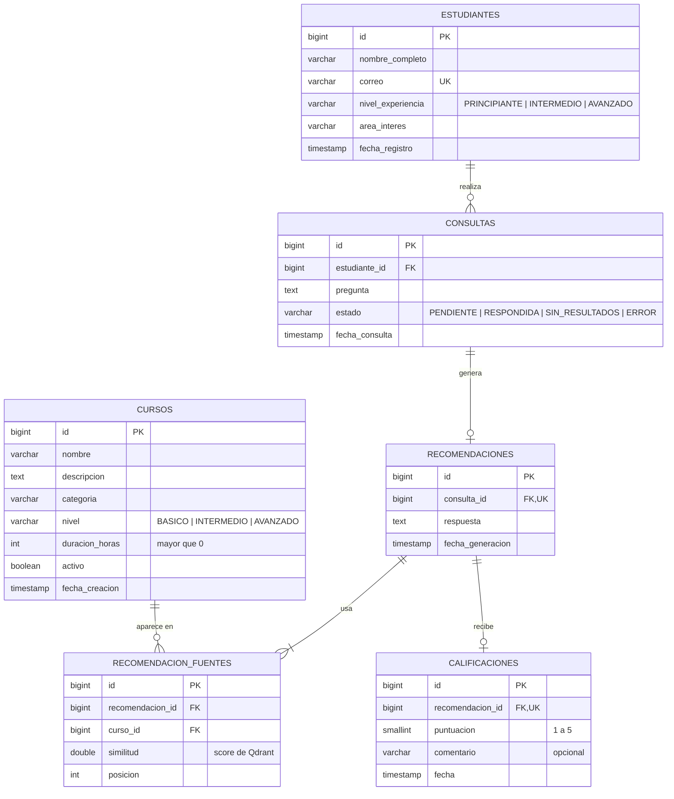

# Diagrama Entidad-Relacion - RutaIA

## Relaciones

| Relacion | Tipo | Como se implementa |
|---|---|---|
| Estudiante - Consultas | 1:N | `consultas.estudiante_id` (FK) |
| Consulta - Recomendacion | 1:0..1 | `recomendaciones.consulta_id` (FK + UNIQUE) |
| Recomendacion - Cursos | N:M | tabla intermedia `recomendacion_fuentes` |
| Recomendacion - Calificacion | 1:0..1 | `calificaciones.recomendacion_id` (FK + UNIQUE) |

## Indices justificados

| Indice | Justificacion |
|---|---|
| `idx_cursos_categoria_nivel` | Filtros del catalogo por categoria y nivel (RF 04) |
| `idx_cursos_activo` | El catalogo y la busqueda solo usan cursos activos |
| `idx_consultas_estudiante_fecha` | Historial del estudiante ordenado por fecha (RF 16) |
| `idx_consultas_estado` | Estadisticas por estado de consulta (RF 18) |
| `idx_fuentes_curso` | Calculo del curso mas recomendado (RF 18) |

Las restricciones UNIQUE (correo, consulta_id, recomendacion_id) crean su propio indice automaticamente.
