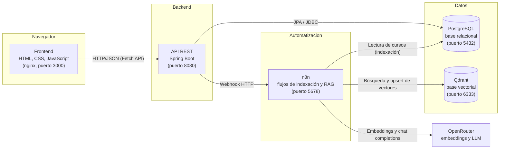
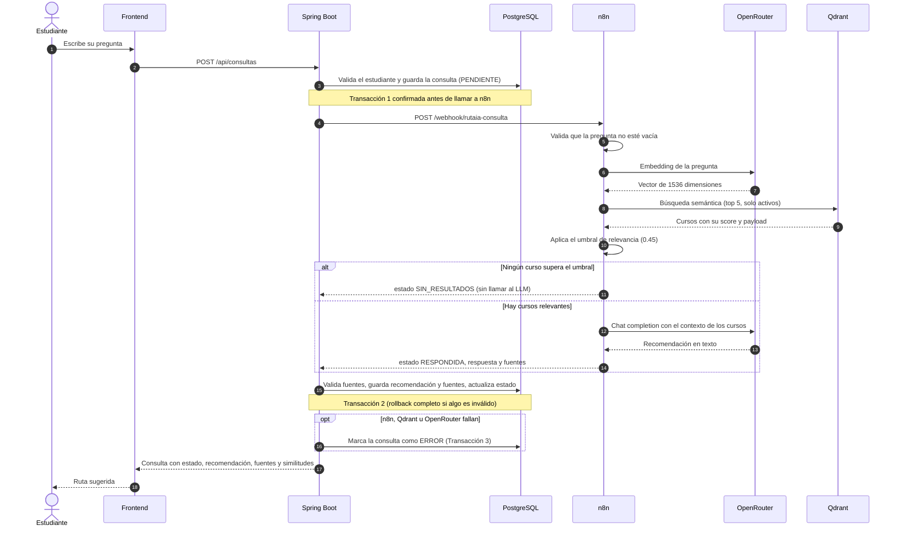
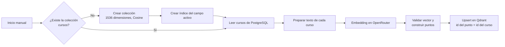

# Arquitectura de RutaIA

## Vista de componentes

**Reglas de comunicación:**

- El frontend **solo** se comunica con la API de Spring Boot. Nunca llama directamente a n8n,
  Qdrant, OpenRouter ni PostgreSQL.
- Spring Boot es el dueño de la base relacional y la **fuente de la verdad**: valida que las fuentes
  devueltas por Qdrant existan y estén activas antes de guardarlas.
- n8n es el único componente que conoce la API key de OpenRouter (guardada cifrada como credencial).
- PostgreSQL, Qdrant, n8n y el frontend corren como contenedores Docker en la misma red interna.
  Dentro de esa red se comunican por nombre de servicio (por ejemplo, `http://qdrant:6333`).

## Secuencia de una consulta (flujo RAG)

## Flujo de indexación

El ID de cada punto en Qdrant es el mismo ID del curso en PostgreSQL. Como el guardado es un
*upsert*, ejecutar el flujo varias veces actualiza los puntos existentes en lugar de duplicarlos.

## Decisiones técnicas principales

| Decisión | Motivo |
|---|---|
| Llamada a n8n fuera de transacciones | Permite registrar la consulta como PENDIENTE antes de llamar a n8n y no bloquear conexiones de la base durante la llamada al LLM. |
| Validación de fuentes en Spring Boot | Qdrant es una copia de los datos y puede desactualizarse. PostgreSQL es la fuente de la verdad. |
| Umbral de 0.45 calibrado con datos reales | Ver `docs/calibracion_umbral.md`. |
| Doble filtro: umbral y prompt | El umbral elimina el ruido grueso; el prompt, las coincidencias por palabras. |
| Solo se vectoriza la pregunta | El perfil del estudiante personaliza la respuesta en el prompt, pero no altera la búsqueda. |
| Desactivación lógica de cursos | Conserva la integridad de las recomendaciones históricas. |
| `ddl-auto=validate` | Las tablas las define el script SQL; Hibernate solo verifica que coincidan. |
