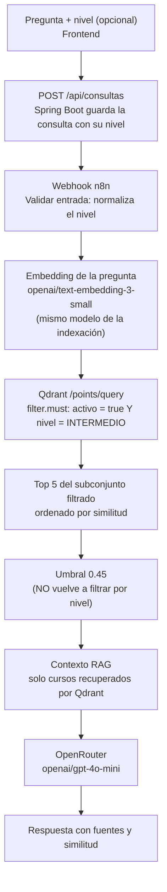

# Examen #1: Filtro semántico por nivel

## Objetivo

Permitir que el estudiante indique el **nivel de curso deseado** durante una consulta inteligente,
y aplicar ese nivel como **filtro del payload dentro de la búsqueda vectorial de Qdrant**.

## Flujo implementado



## Cómo se cumple cada requerimiento

| Requerimiento | Implementación |
|---|---|
| Recibir la pregunta y el nivel | `ConsultaRequest` tiene el campo opcional `nivelCurso`. Acepta "Intermedio", "intermedio", "Básico" o "BASICO". Se guarda en la nueva columna `consultas.nivel_curso` y se envía a n8n. |
| Mismo modelo de embeddings | El nodo *Embedding de la pregunta* usa `openai/text-embedding-3-small`, el mismo del flujo de indexación. |
| Consultar Qdrant con el embedding | Nodo *Buscar en Qdrant*: `POST /collections/cursos/points/query` con `query` = vector de la pregunta. |
| Nivel como filtro dentro de la búsqueda | El nodo *Validar vector* construye `filter.must` con `activo = true` y, si hay nivel, `nivel = <NIVEL>`. Ese filtro viaja **en la misma petición** a Qdrant. |
| Conservar el orden por similitud | Qdrant devuelve los puntos ordenados por score. *Aplicar umbral* solo descarta los que no superan 0.45 y numera las posiciones en el mismo orden. |
| Enviar al LLM solo lo recuperado | El contexto se arma únicamente con los puntos devueltos por Qdrant. El prompt indica además el nivel solicitado. |
| Devolver la similitud de cada fuente | Cada fuente de la respuesta incluye `similitud` (y `nivel`). El frontend la muestra con una barra. |
| Sin nivel, búsqueda sin filtro | Si `nivelCurso` es `null` o vacío, `filter.must` solo contiene `activo = true`. |

## Restricción clave: el filtro NO se aplica después

Cuerpo real enviado a Qdrant para el escenario del examen:

```json
{
  "query": [0.0123, -0.0456, "... 1536 valores ..."],
  "limit": 5,
  "with_payload": true,
  "with_vector": false,
  "filter": {
    "must": [
      { "key": "activo", "match": { "value": true } },
      { "key": "nivel", "match": { "value": "INTERMEDIO" } }
    ]
  }
}
```

**¿Por qué importa?** Si se pidiera el top 5 sin filtro y luego se descartaran los niveles distintos,
podría quedar una lista vacía aunque existan cursos intermedios relevantes en la posición 6 o 7. Con el
filtro dentro de la consulta, Qdrant solo compara la pregunta contra los puntos que cumplen la
condición y devuelve **el top 5 del nivel pedido**.

El nodo *Aplicar umbral* tiene un comentario explícito: **no filtra por nivel**, porque ese filtro ya
lo aplicó Qdrant.

## Índice de payload

Se creó un índice de tipo `keyword` sobre el campo `nivel` en la colección `cursos`, para que el filtro
sea eficiente aun con miles de cursos. El flujo de indexación lo crea automáticamente en instalaciones
nuevas (nodo *Crear índice nivel*).

## Archivos modificados

| Archivo | Cambio |
|---|---|
| `database/migracion_examen_nivel.sql` | **Nuevo.** Agrega la columna `nivel_curso` sin borrar datos |
| `database/schema.sql` | Columna `nivel_curso` para instalaciones nuevas |
| `backend/.../dto/consulta/ConsultaRequest.java` | Campo opcional `nivelCurso` |
| `backend/.../dto/consulta/ConsultaResponse.java` | Devuelve el nivel usado como filtro |
| `backend/.../model/Consulta.java` | Atributo `nivelCurso` |
| `backend/.../model/enums/NivelCurso.java` | Un texto vacío se interpreta como "sin nivel" |
| `backend/.../integration/n8n/N8nConsultaRequest.java` | Envía `nivelCurso` a n8n |
| `backend/.../service/ConsultaService.java` | Guarda el nivel y lo envía a n8n |
| `n8n/workflows/02_consulta_rag.json` | Filtro por nivel dentro de la consulta a Qdrant |
| `n8n/workflows/01_indexacion_cursos.json` | Índice de payload `nivel` |
| `frontend/consulta.html` y `js/consulta.js` | Selector de nivel y nota del filtro aplicado |
| `frontend/js/historial.js` | Muestra el nivel filtrado en el historial |
| `docs/RutaIA.postman_collection.json` | Carpeta *6. Examen* con 4 pruebas automáticas |

## Pruebas

| Prueba | Resultado esperado |
|---|---|
| "Quiero aprender a crear APIs" + Intermedio | RESPONDIDA; **todas** las fuentes son de nivel INTERMEDIO, ordenadas por similitud |
| Misma pregunta sin nivel | RESPONDIDA; fuentes de cualquier nivel |
| Nivel "básico" (minúsculas y tilde) | Se normaliza a BASICO |
| Nivel "Experto" | 400 Bad Request, no se crea la consulta |

Evidencia: capturas en `docs/evidencias/examen/` (petición a Qdrant en la ejecución de n8n, respuesta
de la API y pantalla del frontend).
